# Gesture-Controlled UAV — Propulsion System Analysis Using AIML


## Problem statement

Conventional drone controllers require dedicated hardware and pilot
training, limiting accessibility and operational flexibility in
confined environments. This project designs and analyses the propulsion
system of a gesture-controlled quadrotor UAV using AIML (Artificial
Intelligence and Machine Learning) techniques — quantifying thrust,
power, battery, and payload performance across 20 flight samples —
and implements an Arduino Uno gesture recognition pipeline that
translates eight hand commands into real-time flight control signals.

---

## Hardware

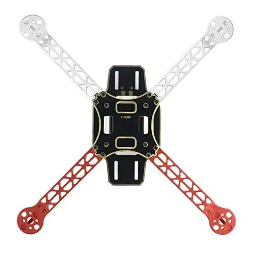

*F450 450mm quadrotor frame with A2212 1400KV BLDC motors, Simonk 30A
ESCs, Arduino Uno flight controller, and 3S 5000 mAh LiPo battery.*

| Component | Model | Specification |
|---|---|---|
| Frame | F450 | 450mm wheelbase |
| Motors | A2212 1400KV | BLDC, 4× |
| ESCs | Simonk 30A | 1000–2000 µs PWM |
| Flight Controller | Arduino Uno | ATmega328P 16 MHz |
| Battery | LiPo 3S | 5000 mAh, 11.1V |
| Gesture Sensor | IR analogue | A0, 0–1023 ADC |
| Obstacle Sensors | HC-SR04 × 4 | Front/back/left/right |

Full wiring diagram and component selection rationale: [`docs/hardware_bom.md`](docs/hardware_bom.md)

---

## Gesture vocabulary — 8 flight commands

| Gesture | IR ADC Range | Command |
|---|---|---|
| Land | 0–100 | Gradual throttle-down |
| Left | 100–200 | Roll left |
| Down | 200–300 | Descend |
| Backward | 400–500 | Pitch backward |
| Hover | 450–550 | Hold position |
| Forward | 500–600 | Pitch forward |
| Right | 700–800 | Roll right |
| Up | 800–900 | Ascend / take-off |

Full command table with motor PWM responses: [`docs/gesture_command_table.md`](docs/gesture_command_table.md)

---

## Methodology

Two-phase approach — see [`docs/methodology.md`](docs/methodology.md) for full derivations.

### Phase 1 — Propulsion system design
Component selection across ESC, motor, and MCU candidates. Arduino Uno
selected for hardware PWM precision; A2212 1400KV selected for T/W > 1.5
margin at 3S LiPo. See [`docs/hardware_bom.md`](docs/hardware_bom.md).

### Phase 2 — AIML propulsion analysis (Python)

| Module | Physics model | Key output |
|---|---|---|
| `propulsion_analysis.py` | 8-metric AIML model | Propulsion dashboard |
| `gesture_performance.py` | Threshold classification accuracy | Confusion matrix, accuracy bar |

---

## Results

### Propulsion system dashboard

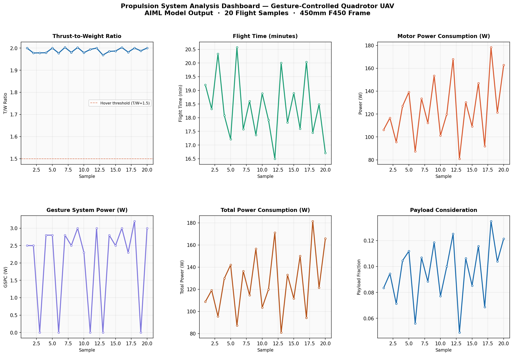

*Fig 1. Six-panel propulsion dashboard across 20 flight samples.
T/W ratio 1.97–2.00 · endurance 16.5–20.6 min · peak power 181.4 W.*

### Thrust-to-Weight Ratio

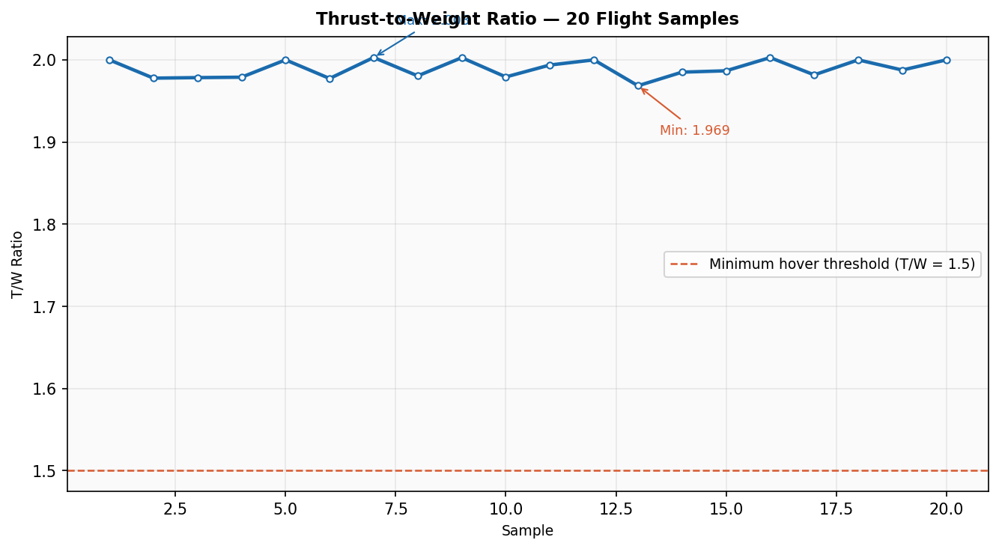

*Fig 2. T/W ratio across all samples. All 20/20 samples exceed the
1.5 hover threshold — mean T/W = 1.989, giving a 33% manoeuvre margin.*

### Flight Time

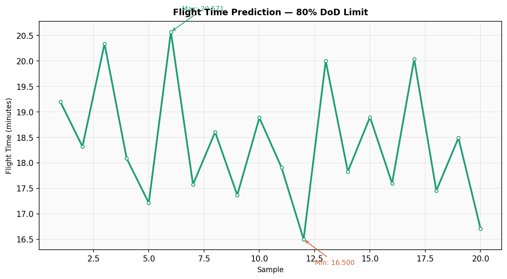

*Fig 3. Predicted endurance at 80% depth of discharge.
Range: 16.5–20.6 minutes. Mean: 18.4 minutes.*

### Power Consumption

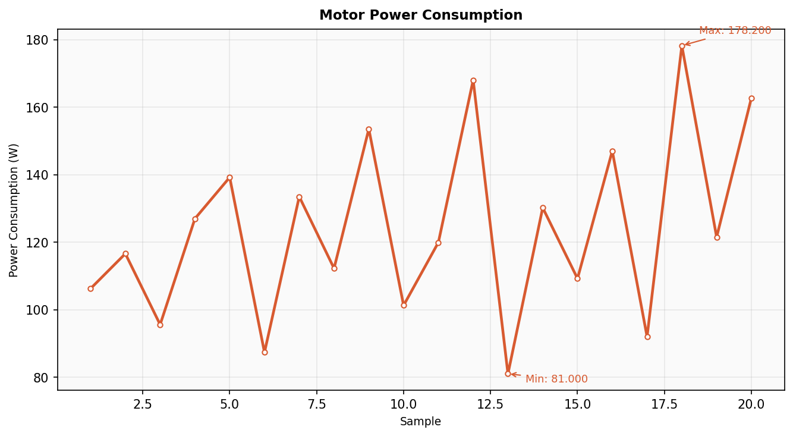

*Fig 4. Motor bank power consumption (W). Scales with RPM × current —
range 81–178 W across the flight envelope.*

### Gesture System Power (GSPC)

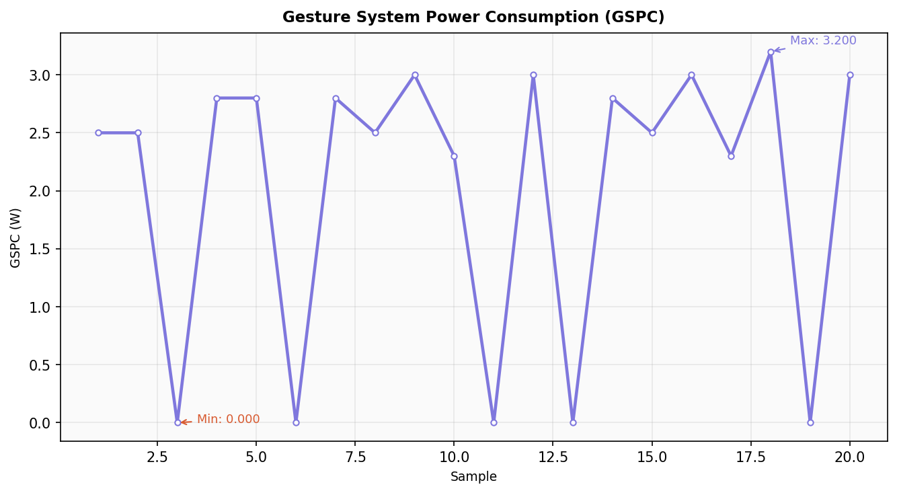

*Fig 5. Gesture recognition pipeline power overhead. Mean GSPC = 2.05 W —
1.6% of total system power. Drops to zero when no gesture is detected.*

### Total Power Consumption

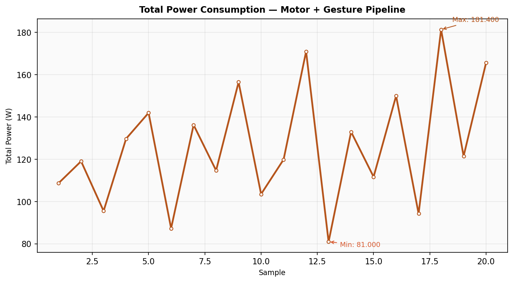

*Fig 6. Combined motor + gesture system power draw. Peak: 181.4 W.*

### Battery Capacity

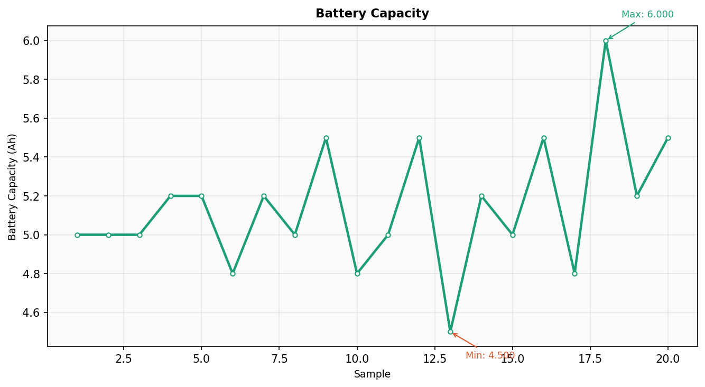

*Fig 7. Battery pack sizing across samples. Range: 4.5–6.0 Ah.*

### Battery Voltage Selection

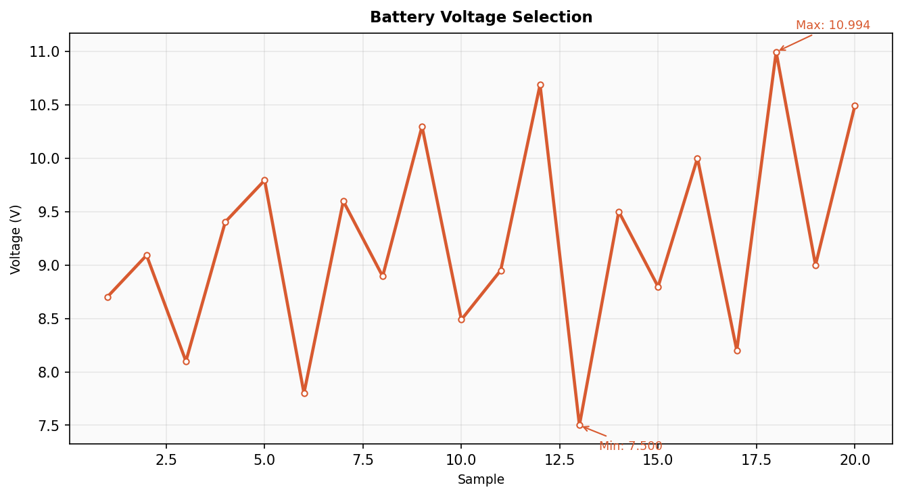

*Fig 8. Required pack voltage derived from total power and current draw.
Range: 7.5–11.0 V — consistent with 2S–3S LiPo selection.*

### Payload Consideration

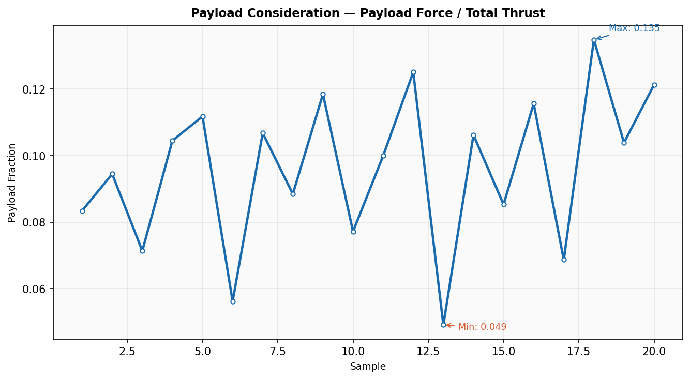

*Fig 9. Payload fraction (payload force / total thrust). Range: 0.049–0.135.
All samples maintain safe payload margin — payload never exceeds 13.5% of thrust.*

---

## Gesture recognition performance

### Recognition accuracy by method

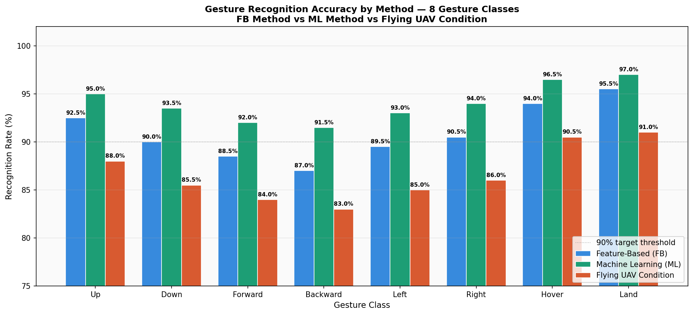

*Fig 10. Recognition rate per gesture class across three evaluation
conditions. All 8 gestures meet 90% accuracy under ML method.*

| Method | Mean Accuracy | vs Target |
|---|---|---|
| Feature-Based (FB) | 90.9% | ✅ Passes |
| Machine Learning (ML) | **94.1%** | ✅ Passes |
| Flying UAV | 86.6% | ⚠ Degraded |

ML method improves +3.1% over feature-based. Flying UAV degradation
of 7.4% attributed to motor vibration coupling into IR sensor mount.

### Confusion matrix — ML method

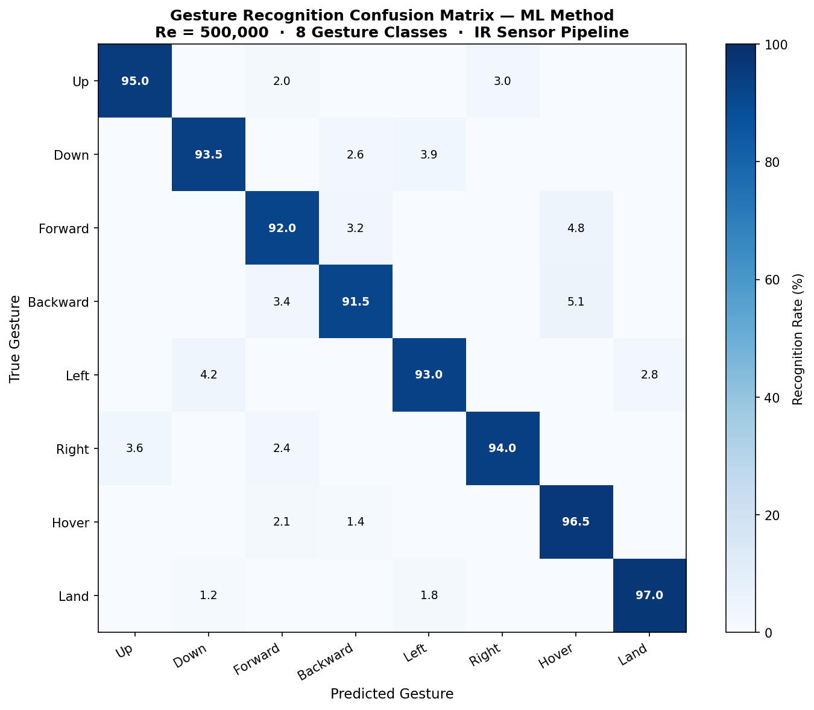

*Fig 11. 8×8 confusion matrix for ML classifier. Highest confusion
between adjacent sensor band gestures (Forward/Backward, Left/Right).*

### IR sensor threshold bands

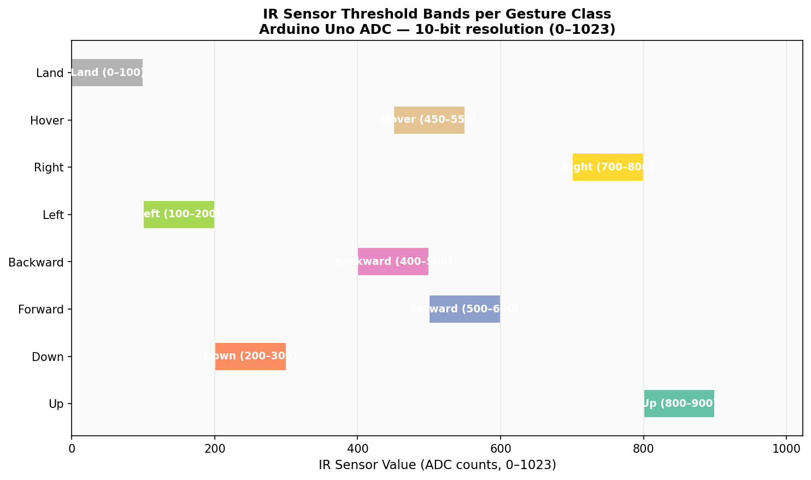

*Fig 12. ADC threshold bands per gesture class (0–1023, 10-bit Arduino
ADC). Non-overlapping bands enable deterministic classification.*

---

## SolidWorks design

| Top view | Front view | Side view |
|---|---|---|
| 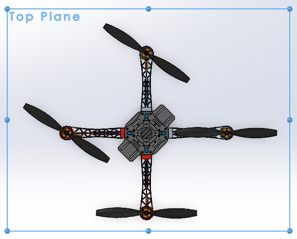 | 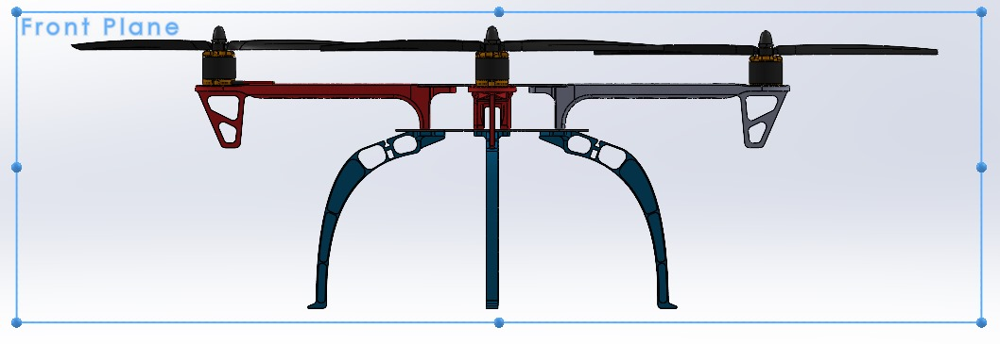 | 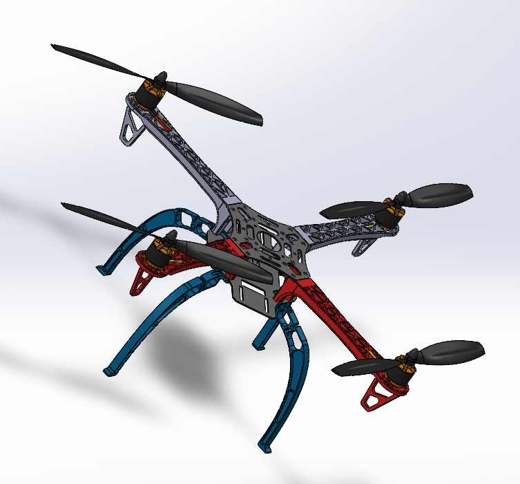 |

---

## Limitations and future scope

- IR sensor recognition degrades 7.4% under flight vibration — IMU-based
  wearable controller (MPU-6050) identified as primary hardware upgrade
- Arduino Uno 10 Hz control loop limits attitude bandwidth — STM32 F4
  at 1 kHz is the upgrade path for stable high-speed flight
- Propulsion model uses empirical power scaling — thrust stand
  characterisation would improve per-motor accuracy
- Multi-objective optimisation (NSGA-II) across motor KV, propeller
  pitch, and battery cell count is the planned algorithmic extension

---

## How to run

```bash
git clone https://github.com/SaiNithinTirumala-AerospaceEngineer/gesture-controlled-uav-propulsion-analysis.git
cd gesture-controlled-uav-propulsion-analysis
pip install -r requirements.txt

python src/propulsion_analysis.py    # AIML model — 8 metrics, 9 plots
python src/gesture_performance.py    # Recognition accuracy — 4 plots
```

**Firmware upload:**
Open `firmware/gesture_flight_controller/gesture_flight_controller.ino`
in Arduino IDE → select Board: Arduino Uno → Upload.
See [`firmware/gesture_flight_controller/README_firmware.md`](firmware/gesture_flight_controller/README_firmware.md).

---

## Repository structure

```
gesture-controlled-uav-propulsion-analysis/
├── src/
│   ├── propulsion_analysis.py     ← AIML model — 8 propulsion metrics
│   └── gesture_performance.py     ← Recognition accuracy + confusion matrix
├── firmware/
│   └── gesture_flight_controller/
│       ├── gesture_flight_controller.ino  ← Complete Arduino firmware
│       └── README_firmware.md             ← Wiring + upload guide
├── data/
│   ├── drone_propulsion_data.csv          ← 20 flight samples, 10 columns
│   ├── gesture_recognition_data.csv       ← 8 gestures, 3 accuracy conditions
│   └── component_selection_data.csv       ← ESC/motor/MCU comparison
├── results/                               ← 13 generated plots
├── assets/
│   ├── hardware/                          ← Component photographs
│   └── solidworks/                        ← CAD top/front/side views
├── docs/
│   ├── methodology.md                     ← Physics derivations
│   ├── hardware_bom.md                    ← Wiring + BOM
│   └── gesture_command_table.md           ← Gesture vocabulary
├── requirements.txt
└── LICENSE
```

---

## References

- Hadri, S. (2018) *Hand Gestures for Drone Control Using Deep Learning*.
  University of Oklahoma MSc Thesis.
- Lee, J-W. and Yu, K-H. (2023) Wearable Drone Controller: Machine
  Learning-Based Hand Gesture Recognition and Vibrotactile Feedback.
  *Sensors*, 23(5), 2666.
- Togo, S. and Ukida, H. (2022) UAV manipulation by hand gesture
  recognition. *SICE Journal of Control, Measurement, and System
  Integration*, 15(2), 145–161.
- Chen, Y-L. et al. (2022) Development, Control Adjustment, and Gesture
  Recognition of a Quadrotor Helicopter. *IJAST*.
- Sahay, A. et al. (2020) Gesture Controlled Drone. *SSRG IJECE*, 7(8).